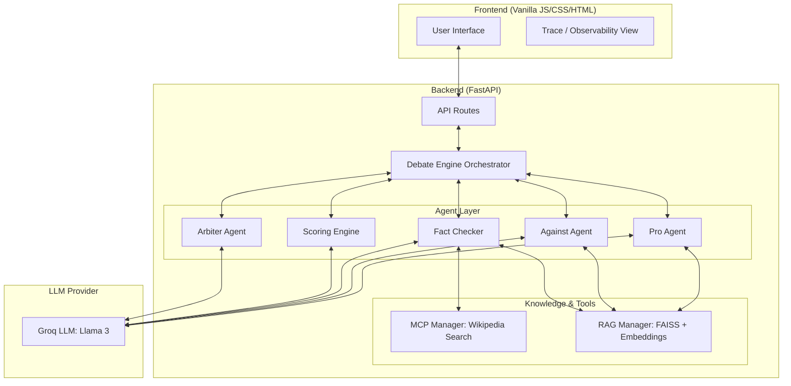

# Multi-Agent AI Debate System

### *Structured, Explainable, and Intelligent AI Discourse Platform*

An end-to-end, modular platform that simulates structured debates between AI agents with opposing viewpoints. The system integrates **tool-augmented reasoning, real-time fact-checking, and persistent memory** to produce transparent, evidence-backed conclusions.

---

## 🎯 Overview

This system enables **intelligent multi-agent reasoning** by orchestrating specialized AI agents into a controlled debate environment. Each agent plays a defined role—argument generation, fact verification, scoring, and final arbitration—ensuring **logical consistency, factual accuracy, and explainability**.

---

## 🏗️ System Architecture



---

## 🧠 Deep Dive: Technical Architecture

### 1. Orchestration & State Management (`DebateEngine`)
The `DebateEngine` acts as the central nervous system. Unlike simple chat apps, this system manages complex **state transitions**:
- **Turn Order**: Orchestrates a strict `PRO → AGAINST → USER` loop across multiple rounds.
- **Session Isolation**: Each `DebateSession` is uniquely identified (UUID), maintaining its own history, status, and memory index.
- **Synchronous Logic**: Coordinates Fact-Checking and Scoring *before* moving to the next turn, ensuring every argument is immediately analyzed.

### 2. The Agent Model (`BaseAgent`)
Agents in this system are **stateless and persona-driven**. 
- Every agent (Pro, Against, Arbiter) inherits from a `BaseAgent` that handles communication with the **Groq API**.
- **Dynamic Context Injection**: Before an agent "speaks," the engine injects relevant historical context and instructions into the system prompt, forcing the agent to stay in character and maintain topical relevance.

### 3. Tool-Augmented Fact Checking (MCP)
The **Fact Checker** is our most advanced agent. It doesn't just "guess"—it uses the **Model Context Protocol (MCP)**:
- When a claim is made, the Fact Checker triggers a tool call (e.g., `wikipedia_search`).
- It processes the external data and returns a structured JSON assessment (Confidence, Assessment, Reasoning).
- This grounded feedback is then appended to the debate history, influencing subsequent arguments.

### 4. Semantic Memory Pipeline (RAG)
To solve the "long-context" problem, we use **Retrieval-Augmented Generation**:
- **FAISS Vector DB**: Every argument is embedded using `sentence-transformers` and stored in a session-specific FAISS index.
- **Semantic Retrieval**: When an agent prepares a response, the system searches the index for the top-3 most semantically similar past arguments.
- **Consistency**: This allows agents to "remember" and counter points made several rounds ago, even if the raw context window is crowded.

### 5. Objective Arbitration
The **Arbiter Agent** is only invoked at the end. It is provided with the *entire* normalized history and tasked with identifying a winner based on logical flow, evidence quality (provided by the Fact Checker), and the cumulative scores from the **Scoring Engine**.

### 6. Observability & The "Trace" System
To move beyond a "black box" AI, we implemented a dedicated **Trace API (`/trace`)**:
- **Internal State Inspection**: The frontend can query this endpoint to pull the raw document store from the FAISS index.
- **Reasoning Transparency**: This allows users to see exactly what "memories" were used by an agent for a specific turn, providing a clear path from data retrieval to final argument.
- **Audit Trail**: Every tool call and its raw output is preserved, making the system's reasoning process fully auditable.

---

## 🚀 Core Features

### 🧩 Multi-Agent Debate Engine

* Dual-agent system: **PRO vs AGAINST**
* Iterative debate loop with structured turn-taking
* Supports user participation (optional extension)

### 🔍 Real-Time Fact Verification

* Dedicated **Fact-Checker Agent**
* Validates claims using external knowledge sources
* Reduces hallucinations and improves reliability

### 🔗 Tool-Augmented Reasoning (MCP)

* Integrates external tools (e.g., Wikipedia search)
* Enhances argument grounding with real-world data

### 🧠 Persistent Memory (RAG)

* Uses **FAISS + Sentence Transformers**
* Maintains long-context awareness across debate rounds
* Enables context-aware reasoning

### 📊 Intelligent Scoring Engine

* Evaluates arguments based on:

  * Logical consistency
  * Evidence strength
  * Relevance

### ⚖️ Arbiter Agent

* Produces a **final verdict**
* Justifies decisions using full debate history

### 🔎 Full Observability (Trace System)

* Transparent view of:

  * Agent reasoning
  * Tool usage
  * Intermediate steps
* Designed for **debugging and trust**

---

## 🧱 Project Structure

### Backend (FastAPI)

```
backend/
│
├── agents/            # Agent definitions (Pro, Against, Fact-checker, etc.)
├── mcp/               # Tool integration (Model Context Protocol)
├── memory/            # RAG pipeline (FAISS + embeddings)
├── routes/            # API endpoints
├── debate_engine.py   # Core orchestration logic
└── main.py            # Entry point
```

### Frontend (Vanilla JS)

```
frontend/
│
├── index.html         # Main UI
├── styles.css         # Dark theme styling
└── script.js          # UI logic + API integration
```

---

## ⚙️ Tech Stack

* **Backend**: FastAPI
* **Frontend**: HTML, CSS, Vanilla JS
* **LLM Provider**: Groq (Llama 3)
* **Vector DB**: FAISS
* **Embeddings**: Sentence Transformers
* **Architecture Pattern**: Multi-Agent + RAG + MCP

---

## 🛠️ Setup Guide

### Prerequisites

* Python 3.10+
* Groq API Key

---

### 1️⃣ Clone Repository

```bash
git clone <repository-url>
cd debate_proj
```

### 2️⃣ Create Virtual Environment

```bash
python -m venv venv
source venv/bin/activate  # Windows: venv\Scripts\activate
```

### 3️⃣ Install Dependencies

```bash
pip install -r requirements.txt
```

### 4️⃣ Configure Environment

```bash
cp .env.example .env
```

Update `.env`:

```env
GROQ_API_KEY=your_api_key
GROQ_MODEL=llama-3.3-70b-versatile
```

---

### 5️⃣ Run Backend

```bash
uvicorn backend.main:app --reload
```

Access API at:

```
http://127.0.0.1:8000
```

---

### 6️⃣ Run Frontend

```bash
cd frontend
python -m http.server 8080
```

Open:

```
http://localhost:8080
```

---

## 🧪 Testing

Run test suite:

```bash
python -m tests.test_phase5_6
```

---

## 💡 Key Highlights 

* Implements **real-world AI architecture concepts**:

  * Multi-Agent Systems
  * Retrieval-Augmented Generation (RAG)
  * Tool-Augmented Reasoning (MCP)

* Focuses on **Explainable AI (XAI)** via traceability

* Designed for **scalability and modularity**

* Bridges gap between **LLMs and structured reasoning systems**

---

## 🔮 Future Enhancements

* Live web search integration
* Debate visualization dashboards
* Multi-modal support (voice / documents)
* Deployment (Docker + Cloud)

---

## 🤝 Contribution

Contributions, ideas, and improvements are welcome!

---

## 📜 License

MIT License

---

## 👨‍💻 Author

**Prabhanjan J**


